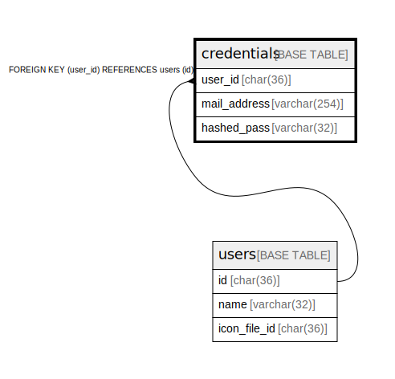

# credentials

## Description

<details>
<summary><strong>Table Definition</strong></summary>

```sql
CREATE TABLE `credentials` (
  `user_id` char(36) NOT NULL,
  `mail_address` varchar(254) NOT NULL,
  `hashed_pass` varchar(32) NOT NULL,
  PRIMARY KEY (`user_id`),
  UNIQUE KEY `mail_address` (`mail_address`),
  CONSTRAINT `fk_credentials_user` FOREIGN KEY (`user_id`) REFERENCES `users` (`id`)
) ENGINE=InnoDB DEFAULT CHARSET=utf8mb4
```

</details>

## Columns

| Name | Type | Default | Nullable | Children | Parents | Comment |
| ---- | ---- | ------- | -------- | -------- | ------- | ------- |
| user_id | char(36) |  | false |  | [users](users.md) |  |
| mail_address | varchar(254) |  | false |  |  |  |
| hashed_pass | varchar(32) |  | false |  |  |  |

## Constraints

| Name | Type | Definition |
| ---- | ---- | ---------- |
| fk_credentials_user | FOREIGN KEY | FOREIGN KEY (user_id) REFERENCES users (id) |
| mail_address | UNIQUE | UNIQUE KEY mail_address (mail_address) |
| PRIMARY | PRIMARY KEY | PRIMARY KEY (user_id) |

## Indexes

| Name | Definition |
| ---- | ---------- |
| PRIMARY | PRIMARY KEY (user_id) USING BTREE |
| mail_address | UNIQUE KEY mail_address (mail_address) USING BTREE |

## Relations



---

> Generated by [tbls](https://github.com/k1LoW/tbls)
