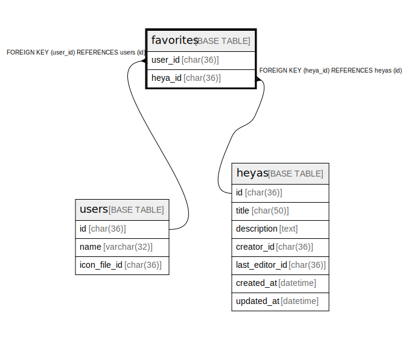

# favorites

## Description

<details>
<summary><strong>Table Definition</strong></summary>

```sql
CREATE TABLE `favorites` (
  `user_id` char(36) NOT NULL,
  `heya_id` char(36) NOT NULL,
  PRIMARY KEY (`user_id`,`heya_id`),
  KEY `idx_favorite_user_id` (`user_id`,`heya_id`),
  KEY `fk_favorites_heya` (`heya_id`),
  CONSTRAINT `fk_favorites_heya` FOREIGN KEY (`heya_id`) REFERENCES `heyas` (`id`),
  CONSTRAINT `fk_favorites_user` FOREIGN KEY (`user_id`) REFERENCES `users` (`id`)
) ENGINE=InnoDB DEFAULT CHARSET=utf8mb4
```

</details>

## Columns

| Name | Type | Default | Nullable | Children | Parents | Comment |
| ---- | ---- | ------- | -------- | -------- | ------- | ------- |
| user_id | char(36) |  | false |  | [users](users.md) |  |
| heya_id | char(36) |  | false |  | [heyas](heyas.md) |  |

## Constraints

| Name | Type | Definition |
| ---- | ---- | ---------- |
| fk_favorites_heya | FOREIGN KEY | FOREIGN KEY (heya_id) REFERENCES heyas (id) |
| fk_favorites_user | FOREIGN KEY | FOREIGN KEY (user_id) REFERENCES users (id) |
| PRIMARY | PRIMARY KEY | PRIMARY KEY (user_id, heya_id) |

## Indexes

| Name | Definition |
| ---- | ---------- |
| fk_favorites_heya | KEY fk_favorites_heya (heya_id) USING BTREE |
| idx_favorite_user_id | KEY idx_favorite_user_id (user_id, heya_id) USING BTREE |
| PRIMARY | PRIMARY KEY (user_id, heya_id) USING BTREE |

## Relations



---

> Generated by [tbls](https://github.com/k1LoW/tbls)
