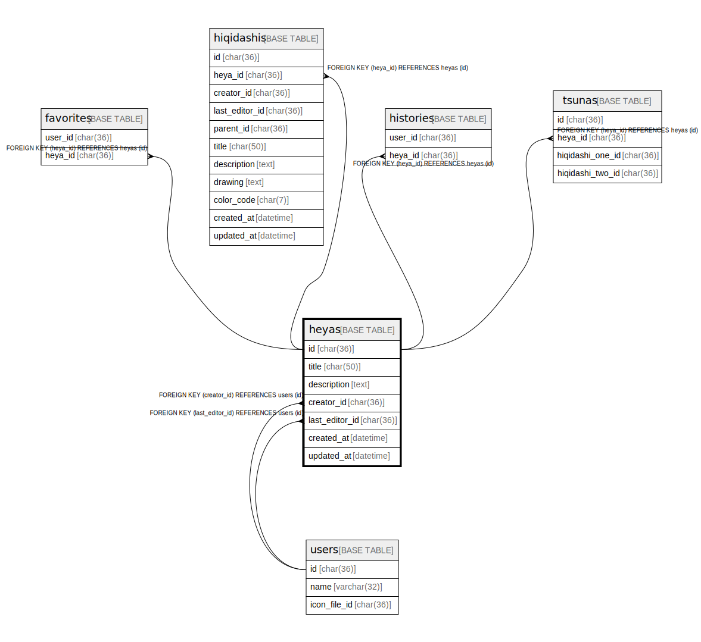

# heyas

## Description

<details>
<summary><strong>Table Definition</strong></summary>

```sql
CREATE TABLE `heyas` (
  `id` char(36) NOT NULL,
  `title` char(50) NOT NULL,
  `description` text NOT NULL,
  `creator_id` char(36) NOT NULL,
  `last_editor_id` char(36) NOT NULL,
  `created_at` datetime NOT NULL DEFAULT current_timestamp(),
  `updated_at` datetime NOT NULL DEFAULT current_timestamp(),
  `deleted` tinyint(1) NOT NULL DEFAULT 0,
  PRIMARY KEY (`id`)
) ENGINE=InnoDB DEFAULT CHARSET=utf8mb4
```

</details>

## Columns

| Name | Type | Default | Nullable | Children | Parents | Comment |
| ---- | ---- | ------- | -------- | -------- | ------- | ------- |
| id | char(36) |  | false |  |  |  |
| title | char(50) |  | false |  |  |  |
| description | text |  | false |  |  |  |
| creator_id | char(36) |  | false |  |  |  |
| last_editor_id | char(36) |  | false |  |  |  |
| created_at | datetime | current_timestamp() | false |  |  |  |
| updated_at | datetime | current_timestamp() | false |  |  |  |
| deleted | tinyint(1) | 0 | false |  |  |  |

## Constraints

| Name | Type | Definition |
| ---- | ---- | ---------- |
| PRIMARY | PRIMARY KEY | PRIMARY KEY (id) |

## Indexes

| Name | Definition |
| ---- | ---------- |
| PRIMARY | PRIMARY KEY (id) USING BTREE |

## Relations



---

> Generated by [tbls](https://github.com/k1LoW/tbls)
