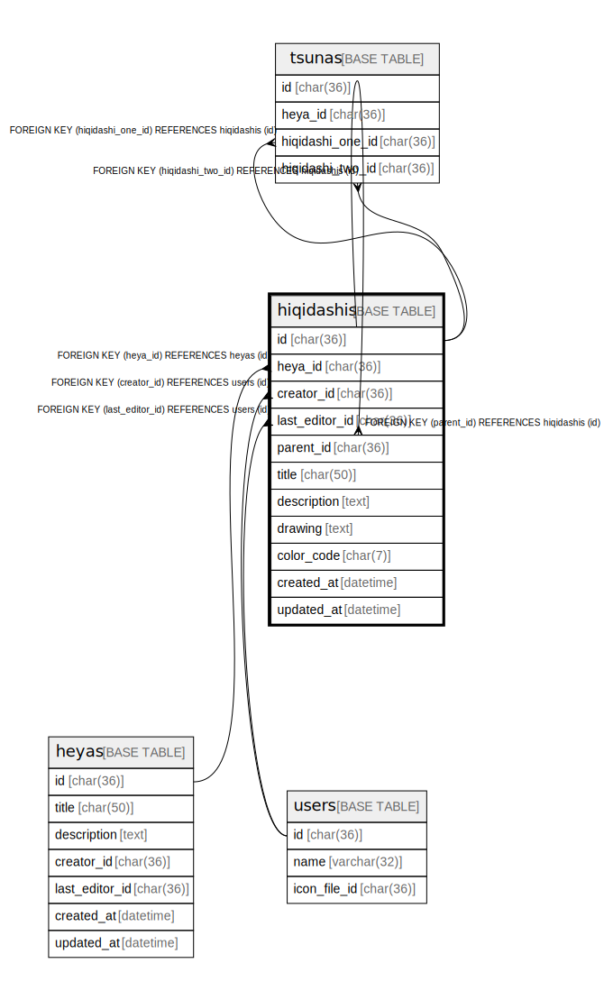

# hiqidashis

## Description

<details>
<summary><strong>Table Definition</strong></summary>

```sql
CREATE TABLE `hiqidashis` (
  `id` char(36) NOT NULL,
  `heya_id` char(36) NOT NULL,
  `creator_id` char(36) NOT NULL,
  `last_editor_id` char(36) NOT NULL,
  `parent_id` char(36) DEFAULT NULL,
  `title` char(50) NOT NULL,
  `description` text NOT NULL,
  `drawing` text DEFAULT NULL,
  `color_code` char(7) NOT NULL DEFAULT '#9E7A7A',
  `created_at` datetime NOT NULL DEFAULT current_timestamp(),
  `updated_at` datetime NOT NULL DEFAULT current_timestamp(),
  PRIMARY KEY (`id`),
  KEY `idx_hiqidashi_heya_id` (`heya_id`,`created_at`),
  KEY `idx_hiqidashi_creator_id` (`creator_id`)
) ENGINE=InnoDB DEFAULT CHARSET=utf8mb4
```

</details>

## Columns

| Name | Type | Default | Nullable | Children | Parents | Comment |
| ---- | ---- | ------- | -------- | -------- | ------- | ------- |
| id | char(36) |  | false |  |  |  |
| heya_id | char(36) |  | false |  |  |  |
| creator_id | char(36) |  | false |  |  |  |
| last_editor_id | char(36) |  | false |  |  |  |
| parent_id | char(36) | NULL | true |  |  |  |
| title | char(50) |  | false |  |  |  |
| description | text |  | false |  |  |  |
| drawing | text | NULL | true |  |  |  |
| color_code | char(7) | '#9E7A7A' | false |  |  |  |
| created_at | datetime | current_timestamp() | false |  |  |  |
| updated_at | datetime | current_timestamp() | false |  |  |  |

## Constraints

| Name | Type | Definition |
| ---- | ---- | ---------- |
| PRIMARY | PRIMARY KEY | PRIMARY KEY (id) |

## Indexes

| Name | Definition |
| ---- | ---------- |
| idx_hiqidashi_creator_id | KEY idx_hiqidashi_creator_id (creator_id) USING BTREE |
| idx_hiqidashi_heya_id | KEY idx_hiqidashi_heya_id (heya_id, created_at) USING BTREE |
| PRIMARY | PRIMARY KEY (id) USING BTREE |

## Relations



---

> Generated by [tbls](https://github.com/k1LoW/tbls)
