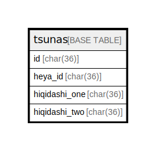

# tsunas

## Description

<details>
<summary><strong>Table Definition</strong></summary>

```sql
CREATE TABLE `tsunas` (
  `id` char(36) NOT NULL,
  `heya_id` char(36) NOT NULL,
  `hiqidashi_one_id` char(36) NOT NULL,
  `hiqidashi_two_id` char(36) NOT NULL,
  PRIMARY KEY (`id`),
  KEY `fk_tsunas_heya` (`heya_id`),
  KEY `fk_tsunas_hiqidashi_one` (`hiqidashi_one_id`),
  KEY `fk_tsunas_hiqidashi_two` (`hiqidashi_two_id`),
  CONSTRAINT `fk_tsunas_heya` FOREIGN KEY (`heya_id`) REFERENCES `heyas` (`id`),
  CONSTRAINT `fk_tsunas_hiqidashi_one` FOREIGN KEY (`hiqidashi_one_id`) REFERENCES `hiqidashis` (`id`),
  CONSTRAINT `fk_tsunas_hiqidashi_two` FOREIGN KEY (`hiqidashi_two_id`) REFERENCES `hiqidashis` (`id`)
) ENGINE=InnoDB DEFAULT CHARSET=utf8mb4
```

</details>

## Columns

| Name | Type | Default | Nullable | Children | Parents | Comment |
| ---- | ---- | ------- | -------- | -------- | ------- | ------- |
| id | char(36) |  | false |  |  |  |
| heya_id | char(36) |  | false |  | [heyas](heyas.md) |  |
| hiqidashi_one_id | char(36) |  | false |  | [hiqidashis](hiqidashis.md) |  |
| hiqidashi_two_id | char(36) |  | false |  | [hiqidashis](hiqidashis.md) |  |

## Constraints

| Name | Type | Definition |
| ---- | ---- | ---------- |
| fk_tsunas_heya | FOREIGN KEY | FOREIGN KEY (heya_id) REFERENCES heyas (id) |
| fk_tsunas_hiqidashi_one | FOREIGN KEY | FOREIGN KEY (hiqidashi_one_id) REFERENCES hiqidashis (id) |
| fk_tsunas_hiqidashi_two | FOREIGN KEY | FOREIGN KEY (hiqidashi_two_id) REFERENCES hiqidashis (id) |
| PRIMARY | PRIMARY KEY | PRIMARY KEY (id) |

## Indexes

| Name | Definition |
| ---- | ---------- |
| fk_tsunas_heya | KEY fk_tsunas_heya (heya_id) USING BTREE |
| fk_tsunas_hiqidashi_one | KEY fk_tsunas_hiqidashi_one (hiqidashi_one_id) USING BTREE |
| fk_tsunas_hiqidashi_two | KEY fk_tsunas_hiqidashi_two (hiqidashi_two_id) USING BTREE |
| PRIMARY | PRIMARY KEY (id) USING BTREE |

## Relations



---

> Generated by [tbls](https://github.com/k1LoW/tbls)
